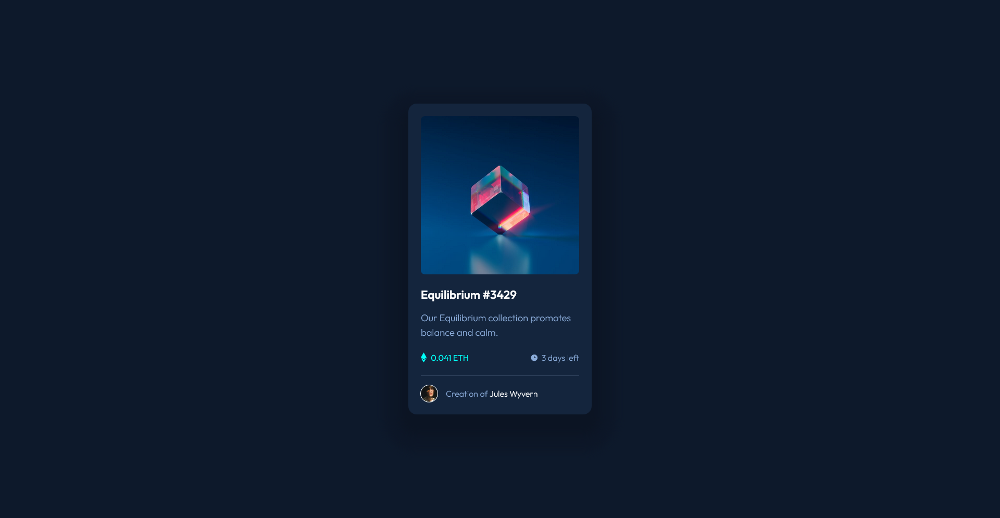

# Frontend Mentor - NFT preview card component solution

This is a solution to the [NFT preview card component challenge on Frontend Mentor](https://www.frontendmentor.io/challenges/nft-preview-card-component-SbdUL_w0U). Frontend Mentor challenges help you improve your coding skills by building realistic projects. 

## Table of contents

- [Overview](#overview)
  - [The challenge](#the-challenge)
  - [Screenshot](#screenshot)
  - [Links](#links)
- [My process](#my-process)
  - [Built with](#built-with)
  - [What I learned](#what-i-learned)
  - [Continued development](#continued-development)
  - [Useful resources](#useful-resources)
- [Author](#author)
- [Acknowledgments](#acknowledgments)

## Overview

### The challenge

Users should be able to:

- View the optimal layout depending on their device's screen size
- See hover states for interactive elements

### Screenshot

### Links

- Solution URL: [GitHub](https://github.com/mbdelarosa/nft-preview-card-component)
- Live Site URL: [NFT Preview Card Component](https://mbdelarosa.github.io/nft-preview-card-component)

## My process

### Built with

- Semantic HTML5 markup
- CSS custom properties
- Flexbox
- CSS Grid
- Mobile-first workflow

### What I learned

- How to add an image to an anchor tag
- How to display an icon overlay on hover/focus using the `::before` and `::after` pseudo-elements and the `position: absolute` property
- Use of the `transition` property for simple hover/focus animation
- That we can apply multiple `box-shadow` properties

### Continued development

I'd like to learn more about the different CSS animations, as well as other use cases of pseudo-elements.

### Useful resources

- [CSS box-shadow] from MDN (https://developer.mozilla.org/en-US/docs/Web/CSS/box-shadow) - Has good explanation and examples of the `box-shadow` property

## Author

- Frontend Mentor - [@mbdelarosa](https://www.frontendmentor.io/profile/mbdelarosa)

## Acknowledgments

The following threads from Discord helped explain how to structure the HTML to show the icon overlay on hover/focus
- [HELP! NFT Preview Card challenge](https://discord.com/channels/824970620529279006/1115263281947488287/1115269415701856347)
- [NFT-card challenge](https://discord.com/channels/824970620529279006/1119346696380493895/1119365835102900418)
